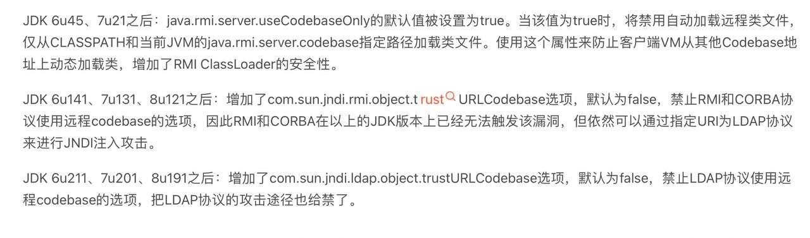

# log4j-rce-demo
## log4j rce 测试项目
## 漏洞原因

log4j在输出日志的时候会经过format，其中会判断是否存在${这样的字符串，如果存在lookup中判断其协议是否是jndi，最后通过jndiManager进行调用

## 参考资料
[JNDI-Injection-Exploit](https://buaq.net/go-93577.html)
[log4j poc](https://buaq.net/go-93563.html)
[漏洞分析](https://hosch3n.github.io/2021/12/10/Log4j2%E6%BC%8F%E6%B4%9E%E6%B5%85%E6%9E%90/)

https://github.com/welk1n/JNDI-Injection-Exploit/blob/master/README-CN.md
